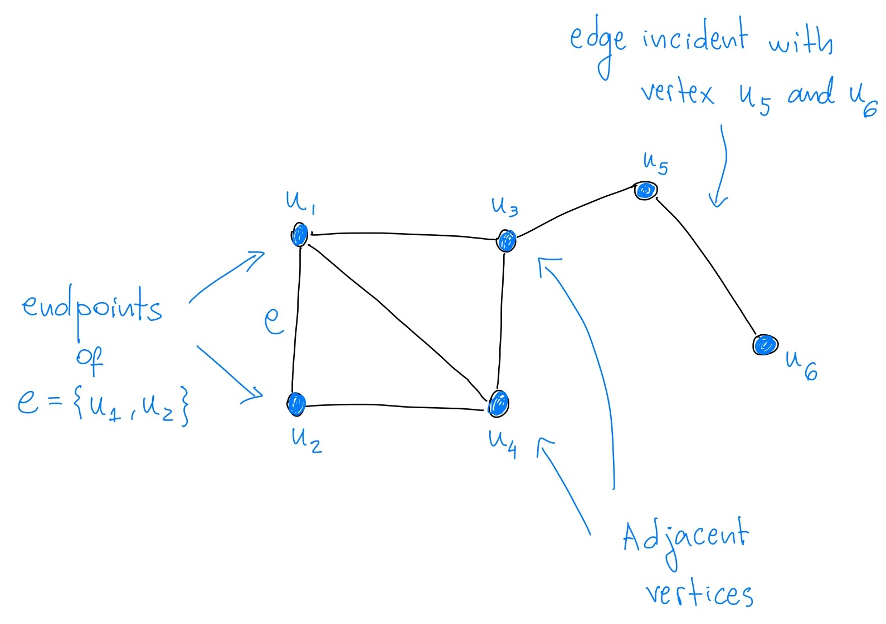
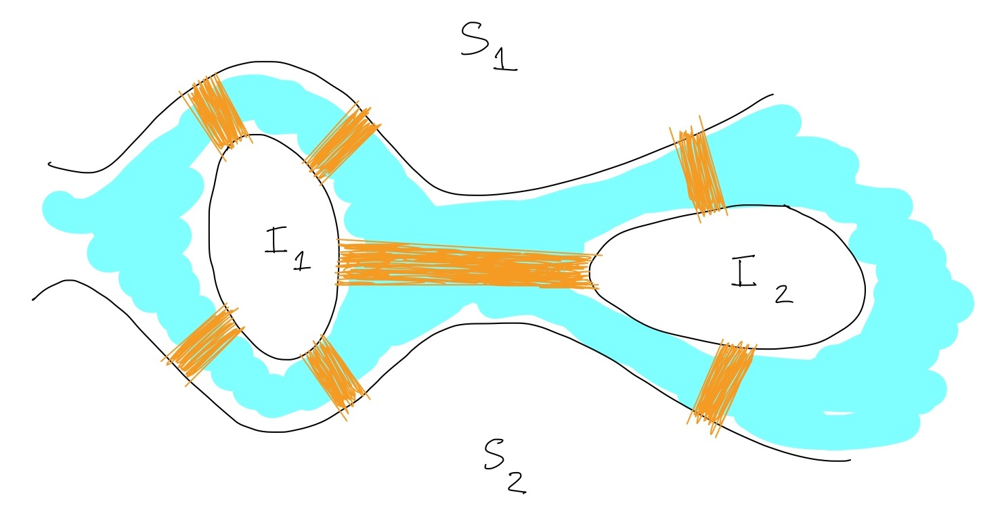
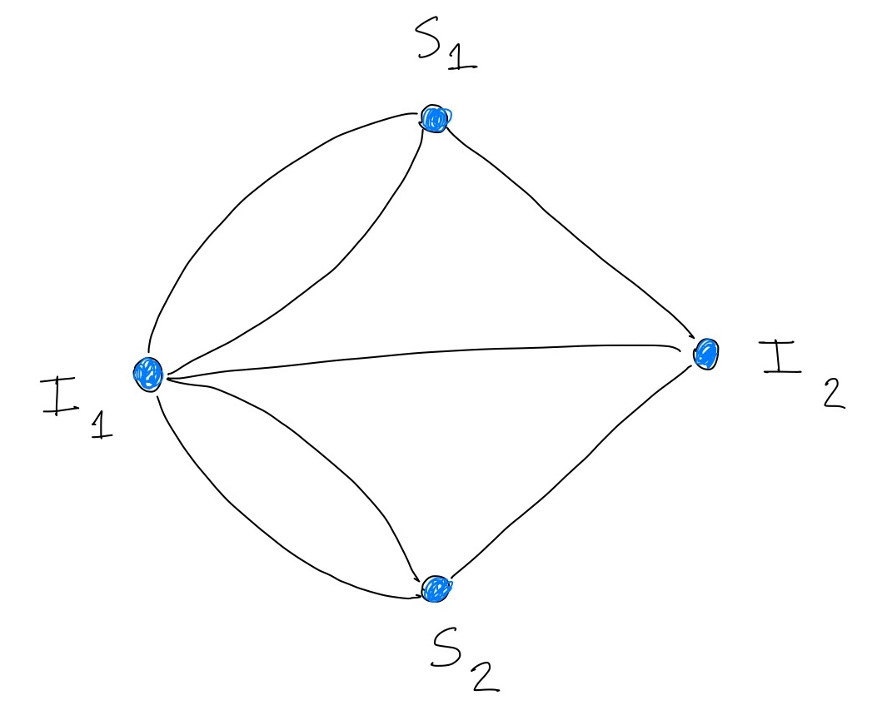

<!-- Load KaTeX CSS and JS -->
<link rel="stylesheet" href="https://cdnjs.cloudflare.com/ajax/libs/KaTeX/0.13.11/katex.min.css">

These are my lecture notes for the course Discrete Structures I at the University of Heidelberg. 
It is based on personal lecture notes of Professor Felix Joos and the following references:

- [Graph Theory, by Reinhard Diestel](https://katalog.ub.uni-heidelberg.de/cgi-bin/titel.cgi?katkey=68186198&sess=5f7a7579bfaf3a64015bcea36e810349&art=f&kat1=freitext&kat2=ti&kat3=au&op1=AND&op2=AND&var1=diestel%20graph%20theory&var2=&var3=)
- [Introduction to Graph Theory, by Douglas West](https://katalog.ub.uni-heidelberg.de/cgi-bin/titel.cgi?katkey=65556254&sess=b50347097cae2224671ddc674cf2f8f3&query=introduction%20to%20graph%20theory)
- [Combinatorial Optimization, by Bernhard Korte and Jens Vygen](https://katalog.ub.uni-heidelberg.de/cgi-bin/titel.cgi?katkey=68239473&sess=b4681c0144bdad684b6bf44a4fee8e1a&art=f&kat1=freitext&kat2=ti&kat3=au&op1=AND&op2=AND&var1=Korte&var2=Combinatorial%20optimisation&var3=)

The code for this page is in markdown and is available on my [GitHub](https://github.com/leticiamat/leticiamat.github.io) repository.

# Table of Contents

1. [The basics of Graph Theory](#lecture-1-the-basics-of-graph-theory)
2. [Graphs as models and an initial glossary of terms](#graphs-as-models-and-an-initial-glossary-of-terms)
3. [Beginning of Graph Theory: the Königsberg bridge problem](#beginning-of-graph-theory-the-königsberg-bridge-problem)
4. [The Handshaking Lemma and the average degree](#the-handshaking-lemma-and-the-average-degree)
5. [Regular graphs](#regular-graphs)
6. [Isomorphism and Automorphism](#isomorphism-and-automorphism)

# Lecture 1: The basics of Graph Theory

Graphs provide a simple way to represent and study relationships between different objects. 

    <strong>Definition 1 (Graphs):</strong> 

A graph is a pair of sets $G = (V, E)$, where $V=V(G)$ is a finite set and $E=E(G)$ is a set of unordered pairs of elements of $V$. That is, 
$$ E \subseteq \{ \{u, v\} \mid u \neq v, u, v \in V \}. $$
$V$ is called the set of vertices, and $E$ is the set of edges.
We often write $uv$ or $vu$ for an edge $\{u,v\}$.

  

Sometimes $v(G) = \mid V(G) \mid$ is called the *order* of the graph $G$ and $e(G) = \mid E(G)\mid$ is called the *size* of the graph $G$.

 **Graphs are a very versatile tool for modelling all kinds of problems, but they are also an interesting mathematical object in their own right.**

 Before we delve into how to use graphs to model problems, we need to establish some vocabulary to facilitate our communication.

    <strong>Definition 2 (Adjacency, incidence, endpoints):</strong> 

Two vertices $u,v$ are <strong>adjacent</strong> in a graph $G$ if $uv\in E(G)$. 
We say that $u$ and $v$ are <strong>endpoints</strong> of the edge $uv$, and we say that an edge $e \in E(G)$ is <strong>incident</strong> with a vertex $v$ if $v\in e$.

 

Local properties are important for understanding global properties of a graph. To explore this, the degree of a vertex is a fundamental concept.

    <strong>Definition 3 (Degree and neighbourhood):</strong> 

For a graph $G$ and a vertex $v\in V(G)$,
we say $u\in V(G)$ is a <strong>neighbour</strong> of $v$ if $uv\in E(G)$.
The set of all neighbours of $v$ is denoted by 
$$
N_G(v) = \{ u \in V(G) \mid uv \in E(G) \}.
$$ 
We refer to it as the <strong>neighbourhood</strong> of $v$.
The <strong>degree</strong> $d_G(v)$ of $v$ is the size of the neighbourhood of $v$. That is, $d_G(v) = \mid N_G(v) \mid$.

 
 

    <strong>Definition 4 (Maximum and minimum degrees):</strong>

The <strong>maximum degree</strong> $\Delta(G)$ of a graph $G$ is the maximum degree of its vertices, that is,
$$
\Delta(G) = \max \{ d_G(v) \mid v\in V(G) \}.
$$
The <strong>minimum degree</strong> $\delta(G)$ of a graph $G$ is the minimum degree of its vertices, that is,
$$
\delta(G) = \min \{ d_G(v) \mid v\in V(G) \}.
$$

 

## How to represent a graph to a human

  
Tap here for more details

   

   The drawing above shows a graph $G$ with 
$$
V(G) = \{u_1, u_2, u_3, u_4, u_5, u_6\}
$$ 
and 
$$
E(G) = \{u_1u_2, u_1u_3, u_1u_4, u_2u_4, u_3u_4, u_3u_5, u_5u_6\}.
$$

The degrees of each vertex are:
$$
d_G(u_1) = d_G(u_3) = d_G(u_4) = 3, \quad d_G(u_2) = d_G(u_5) = 2, \quad d_G(u_6) = 1.
$$

The neighbourhoods of each vertex are:
$$
N_G(u_1) = \{u_2, u_3, u_4\}, \quad N_G(u_2) = \{u_1, u_4\}, \quad N_G(u_3) = \{u_1, u_4, u_5\},
$$
$$
N_G(u_4) = \{u_1, u_2, u_3\}, \quad N_G(u_5) = \{u_3, u_6\}, \quad N_G(u_6) = \{u_5\}.
$$

The maximum and minimum degrees are $\Delta(G) = 3$ and $\delta(G) = 1$, respectively. $\quad \square$

 

## How to represent a graph to a computer

    <strong>Definition 5 (Adjacency matrix):</strong> 

For a graph $G = (V, E)$ with $V = \{v_1, v_2, \ldots, v_n\}$, the adjacency matrix of $G$ is the $n\times n$ matrix $A = (a_{ij})$ where
$$
a_{ij} = \begin{cases} 1 & \text{if } v_i v_j \in E(G), \\ 0 & \text{otherwise}. \end{cases}
$$

  

  
Tap here for a drawing

   
   

 

    <strong>Definition 6 (Incidence matrix):</strong> 

For a graph $G = (V, E)$ with $V = \{v_1, v_2, \ldots, v_n\}$ and $E = \{e_1, e_2, \ldots, e_m\}$, the incidence matrix of $G$ is the $n\times m$ matrix $B = (b_{ij})$ where
$$
b_{ij} = \begin{cases} 1 & \text{if } v_i \text{ is incident with } e_j, \\ 0 & \text{otherwise}. \end{cases}
$$

  

  
Tap here for a drawing

   
   

 

## Graphs as models and an initial glossary of terms

Graphs can model a wide variety of real-world situations and allows us to solve many different types of problems.
They are particularly useful for modeling social and transportation networks, scheduling management, and computer science problems. 
To model these problems precisely, the following definitions are useful.

    <strong>Definition 7 (Subgraph):</strong> 

  A graph $H$ is a <strong>subgraph</strong> of a graph $G$ if $V(H)\subseteq V(G)$ and $E(H)\subseteq E(G)$ or $G\supseteq H$. 
  We also say that $G$ contains $H.$   

  For an edge set $F\subseteq E(G)$, we write $G-F$ for the graph $(V(G),E(G)\setminus F)$. If $F=\{uv\}$, then we write $G-uv$.

 

    <strong>Definition 8 (Induced subgraph):</strong> 

If $H$ is a subgraph of $G$ and for all $u,v\in V(H)$ and $uv\in E(G)$, we also have $uv\in E(H)$, then we say that $H$ is an <strong>induced</strong> subgraph of $G$.  

For a set $U \subseteq V(G)$, we write $G[U]$ for the subgraph induced by $U$; that is, its vertex set is $U$ and contains all edges of $G$ with both ends in $U$.  

We write $G-U$ for the graph $G[V(G)\setminus U]$. If $U=\{u\}$, then we simply write $G-u$.

 

    <strong>Definition 9 (Complement graph):</strong> 

The graph $H$ is the <strong>complement</strong> of $G$ if $V(G)=V(H)$ and $E(H)=\binom{V(G)}{2}\setminus E(G)$. The complement of $G$ is denoted by $\bar{G}.$ 

 

### Social Networks

 Graphs are often used to study social networks. Each person is a vertex, and a connection between two people (like a friendship or a message) is an edge. Graphs help us understand how people are connected, who are the most influential people, or how information spreads. 

 By using the language of graph theory, we can solve the following problem:

    <strong>Problem 1:</strong>

Show that in any group of six people, there are either three people who are all friends with each other, or three people who are all strangers to each other.* Show that this is not true for five people.

 

*The relationship "friend" is symmetric, so if $A$ is a friend of $B$, then $B$ is a friend of $A$.

  
Solution

   

  Let us label the six people as $1, 2, 3, 4, 5$ and $6$ and represent them as vertices in the plane.
  Draw a blue edge connecting two people if they are friends, and a red edge if they are strangers.
  The goal is then to show that there are three vertices connected by edges of the same colour.  

  There are $5$ edges incident to each vertex.
  By the <a href="https://en.wikipedia.org/wiki/Pigeonhole_principle" target="_blank">Pigeonhole Principle</a>, the vertex $1$ has at least $3$ edges of the same colour.
  We have two cases: either this colour is blue or red.
  Let us assume it is blue (the other case is similar).
  Up to relabelling, we can then assume that the vertices $2, 3$ and $4$ are connected to $1$ by blue edges.

 
  
  If any of edges $23$, $34$ or $24$ is blue, then we are done, as we create a blue "triangle" together with the vertex $1.$
  If all of them are red, then we have a red "triangle" with vertices $2, 3$ and $4$.  

  Finally, the statement is not true for five people. Consider the following group of people with the relationships shown in the drawing below. 

   
   
   $\quad \square$

 

This problem is part of [Ramsey theory](https://en.wikipedia.org/wiki/Ramsey_theory), one of the most important areas of combinatorics.

More generally, in a social network we might look for **cliques** and/or **independent sets**.

    <strong>Definition 10 (Clique):</strong>

A <strong>clique</strong> in a graph $G$ is a set of vertices $U\subseteq V(G)$ such that for all distinct vertices $u,v\in U,$ we have $uv\in E(G)$.

 

    <strong>Definition 11 (Independent set):</strong>

An <strong>independent set</strong> in a graph $G$ is a set of vertices $U\subseteq V(G)$ such that for all distinct vertices $u,v\in U,$ we have $uv\notin E(G).$

 

By rephrasing the problem above in this language, we can say that in any graph with six vertices, there is either a clique of size $3$ or an independent set of size $3$.

### Job Assignment

We have $m$ jobs and $n$ people, but not all people are qualified for all jobs. 
Can we fill the jobs with qualified people? We can model this problem using a **bipartite graph**.

    <strong>Definition 12 (Bipartite graph):</strong>

A graph $G$ is <strong>bipartite</strong> if its vertex set can be partitioned into two sets $U$ and $V$ such that every edge has one endpoint in $U$ and the other in $V$. 

 

In the job assignment problem, we can represent each job as a vertex in $U$ and each person as a vertex in $V$.
An edge between a job and a person means that the person is qualified for the job.
The goal is to find a **matching** between jobs and people, where each job is assigned to a qualified person.

    <strong>Definition 13 (Matching):</strong>

A <strong>matching</strong> in a graph $G$ is a set of edges $M\subseteq E(G)$ such that no two edges in $M$ share a vertex.

 

Finding a matching in a bipartite graph is a classic problem in combinatorial optimization.

### Transportation Networks 

In transportation, cities can be represented as vertices, and roads or flights between cities as edges. Graphs help solve problems like finding the shortest **path** from one city to another (e.g., for a GPS system), or **cycle** (e.g., for a delivery company).
See, for example, the [Traveling Salesperson Problem](https://www.youtube.com/watch?v=LL1t1WbdMZw), where the goal is to find the shortest path that visits all cities exactly once and returns to the starting city.

    <strong>Definition 14 (Path):</strong>

A <strong>path</strong> of length $k$ is a graph $P$ with $k+1$ vertices $v_0, v_1, \ldots, v_k$ and $k$ edges $v_iv_{i+1}$ for $i=0,1,\ldots,k-1.$

 

    <strong>Definition 15 (Cycle):</strong>

A <strong>cycle</strong> of length $k$ is a graph $C$ with $k$ vertices $v_0, v_1, \ldots, v_{k-1}$ and $k$ edges $v_iv_{i+1}$ for $i=0,1,\ldots,k-1,$ where $v_k=v_0.$

 

### Scheduling Management 
 Imagine a train schedule, where trains have to be run at certain times.
 Here, the trains are the vertices, and if two of them overlap in time, there is an edge between them.
 The goal is to find the minimum number of crews needed to run all the trains without any conflicts. 
 The answer to this problem is given by the **chromatic number** of the conflict graph.
 

    <strong>Definition 16 (Chromatic number):</strong>

The <strong>chromatic number</strong> of a graph $G$ is the smallest number of colours needed to colour the vertices of $G$ such that no two adjacent vertices have the same colour.

 
 

See this [video](https://www.youtube.com/watch?v=295ONmLcj60) for an example.
Each colour represents a different crew. 

----

## Beginning of Graph Theory: the Königsberg bridge problem

The city of Königsberg, once situated along the Pregel River in Prussia, was divided into two main islands and areas on both riverbanks. These regions were connected by seven bridges, as illustrated below.

Citizens of the city often pondered an intriguing question: could someone leave home, cross each of the seven bridges exactly once, and return home?

This seemingly simple puzzle was famously solved by the mathematician Leonhard Euler in 1736, laying the foundation for graph theory.

Can you solve it too?

  
Tap here for a solution 

   
  
  Let us represented the land areas as vertices and the bridges as edges, as shown below.

  
    

  The problem then becomes: is there a path in this "graph" (this is not a graph, as it has multiple edges) that visits each edge exactly once and returns to the starting vertex?  

  The answer is no! Every vertex time we enter a vertex, we must leave it by a different edge. 
  This means that a necessary condition for such a path to exist is that the degree of each vertex is even.
  But in the graph above, all vertices have an odd degree! So it is impossible to find such a path. $\quad \square$

 

----

## The Handshaking Lemma and the average degree

Our first lemma, known as the Handshaking Lemma, is a fundamental result in graph theory. It says that if we known the degrees of all the vertices in a graph, then we can determine its size.
See the [video](https://www.youtube.com/watch?v=8siY3EjTXxE) for an interactive proof.

    <strong> Lemma 1 (The Handshaking lemma):</strong>

For every graph $G$ we have
$$
\sum_{v\in V(G)} d_G(v) = 2e(G).
$$

  
Proof

   
  
  The informal argument goes as follows: the sum $\sum_{v\in V(G)} d_G(v)$ counts an edge $xy$ twice, once in $d_G(x)$ and once in $d_G(y)$.

  More formally, define

  $$
  S = \{ (v, e) \mid v\in V(G), e\in E(G), v\in e \}.
  $$
  Each $e\in E(G)$ belongs to precisely two pairs in $S$, so 
  $$
  |S|=2e(G).
  $$
  Each $v\in V(G)$ belongs to precisely $d_G(v)$ pairs in $S$, so we also have
  $$
  |S|=\sum_{v\in V(G)}d_G(v). \quad \square 
  $$

 

Just with this lemma, we can already solve one simple problem:)

    <strong>Problem 2:</strong>

Prove that in a graph $G$ there are an even number of vertices of odd degree.

  
Solution

   
  
  Let $V_{\text{odd}}$ be the set of vertices of odd degree and $V_{\text{even}}$ be the set of vertices of even degree in $G$. 
  By the <strong>Handshaking Lemma</strong>, we have
  $$
  \sum_{v\in V_{\text{odd}}} d_G(v) + \sum_{v\in V_{\text{even}}} d_G(v) = 2e(G). 
  $$
  By analysing this equation modulo 2, we have
  $$
  \mid V_{\text{odd}} \mid \,\, \equiv \, \, 0 \pmod{2}. \quad \square
  $$ 

 

The problem above says that if you are given a degree sequence $(d(v): v\in V(G))$ of a graph, then we know that the number of vertices with odd degree is even.
This means that not every sequence of non-negative integers can represent the degree sequence of a graph.

Due to the Handshaking Lemma, it makes sense to define the **average degree** of a graph as below.

    <strong>Definition 17 (Average degree and edge density):</strong>

The <strong>average degree</strong> $d(G)$ of a graph $G$ is the number
$$
d(G) = \dfrac{2e(G)}{v(G)}.
$$

 

For any graph $G$, our next lemma says that we can always find a subgraph with minimum degree greater than half the average degree of $G$.

    <strong> Lemma 2 (Subgraph of large min degree):</strong>

  Every graph $G$ with at least one edge has a subgraph $H$ with 
  $$
  \delta(H) > \dfrac{d(H)}{2} \ge \dfrac{d(G)}{2}.
  $$

 

  
Proof

   
  
  We proceed by induction on the number of vertices.
  The base case is when $G$ has only one edge and two vertices. In this case, we can take $H=G$ and the result is true.  

  We may also assume that $G$ has at least $3$ vertices and that
	$\delta(G)\le d(G)/2$, otherwise we can simply take $H=G$.
  Thus, there is a vertex $v$ in $G$ with a degree
	of at most $d(G)/2$. 
  For simplicity, let $m$ be the number of edges and $n$ be the number of vertices of $G$.   
	Then, we have 
  $$
  \begin{aligned}
  \frac{d(G-v)}{2} = \frac{e(G-v)}{v(G-v)} &=\frac{m-d(v)}{n-1}
		\geq \frac{m-\frac{m}{n}}{n-1}
		& = \frac{1}{n}\cdot\frac{mn-m}{n-1}=\frac{m}{n}=\frac{d(G)}{2}
    \end{aligned}
  $$
  
  Thus, applying the induction hypothesis to $G-v$ we obtain a subgraph $H$
	of $G-v$, and therefore of $G$, with 
	$$
  \delta(H)>\dfrac{d(H)}{2} \ge \dfrac{d(G-v)}{2}\ge \dfrac{d(G)}{2}. \quad \square $$

## Regular graphs

There are many questions we can ask about degree sequences and some of them can be quite challenging. 
One natural question is: 
given a non-negative integer $d$, are there graphs where each vertex has a degree of $d$?

    <strong> Lemma 2 (same degree):</strong>

For every non-negative integer $d$, there are infinitely many graphs $G$ such that $d_G(v) = d$ for all $v\in V(G)$.

 

The proof of this lemma follows directly from the construction of **hypercubes** or **complete bipartite graphs**.

<strong> Definition 4 (Hypercube) :</strong>

The $d$-dimensional hypercube, denoted as $Q_d$, is a graph whose vertex set consists of all binary strings of length $d$, represented by $\{0,1\}^d$. 
Two vertices in this graph are adjacent if and only if they differ in exactly one coordinate.

 

  
Proof of Lemma 2 

   
  
  Each vertex in the hypercube $Q_d$ has degree $d$. 
  To construct infinitely many graphs in which every vertex has degree $d$, one can take disjoint unions of multiple copies of $Q_d$. This process can be repeated as many times as we want. $\quad \square$

 

Graphs where every vertex has the same degree have a special name.

<strong> Definition 5 (regular graphs) :</strong>

For a non-negative integer $d$, a graph $G$ is called $d$-regular if $d_G(v) = d$ for all $v\in V(G)$.

 

Given $n \in \mathbb{N}_{\ge 1}$ and $d \in \mathbb{N}_{\ge 0}$, can we always find a $d$-regular graph with $n$ vertices?
The answer is: it depends. The degree $d$ should be at most $n-1$, for example. By the **Handshaking Lemma**, we should also have $dn$ even. 
But... are these conditions sufficient?
The answer is yes! Showing this is a hard problem.

<strong> Problem 2 :</strong>

Let $n \in \mathbb{N}_{\ge 1}$ and $d \in \mathbb{N}_{\ge 0}$. 
Show that there exists a $d$-regular graph with $n$ vertices if and only if $dn$ is even and $d\leq n-1$.

 

  
Proof

    
  
  By the discussion above, we already know that if there exists a $d$-regular graph with $n$ vertices, then $dn$ is even and $d\leq n-1$.
  For the converse, see the post of Yuval Filmus on [Math Stack Exchange](https://math.stackexchange.com/questions/1163314/degree-of-vertices-in-a-graph). $\quad \square$

 

Well, not every graph is regular. 
But we can nevertheless always find a *reasonable* regular graph *containing* it. 
To formalize this idea, we first need to say what we mean by containing.

## Isomorphism and Automorphism

    <strong>Definition 9 (Isomorphism and automorphism):</strong> 

An isomorphism from a graph $G$ to a graph $H$ is a bijection $f: V(G) \to V(H)$ such that $uv\in E(G)$ if and only if $f(u)f(v)\in E(H).$
When $H = G$, we say that $f$ is an <strong>automorphism</strong> of $G$.   

If there exists an isomorphism from $G$ to $H$, then we say that $G$ and $H$ are <strong>isomorphic</strong>, and we write $G\cong H$.

 

tobedone
- definicao de subgrafo
- proposicao

