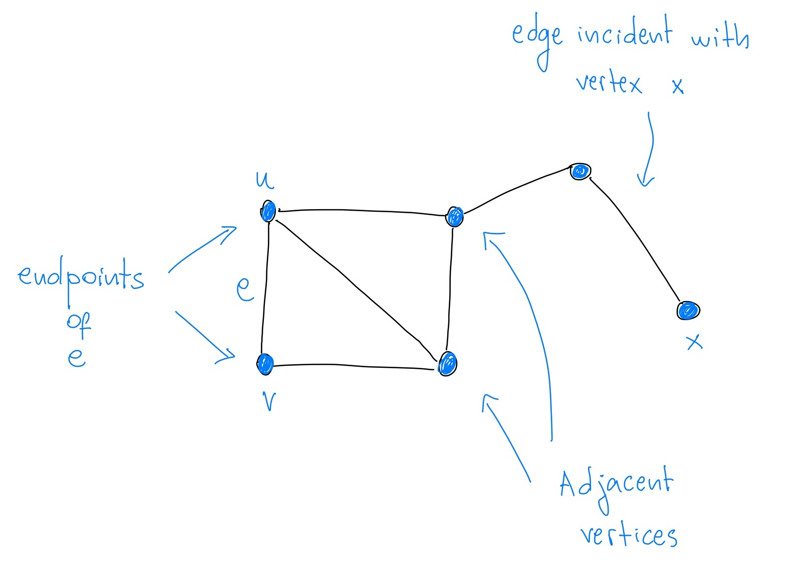
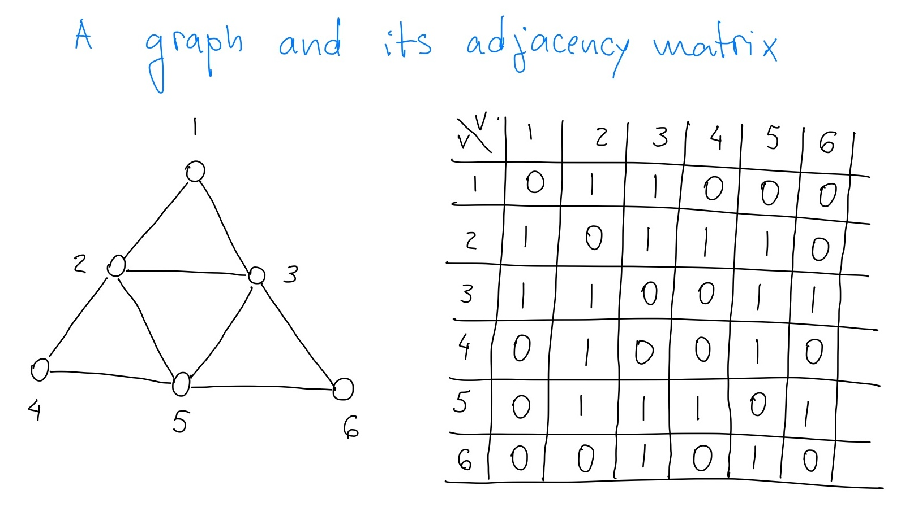
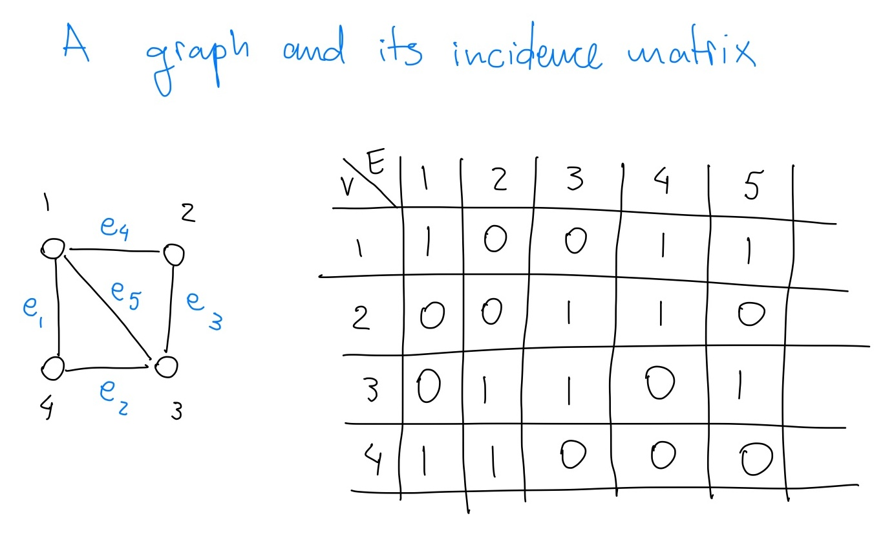
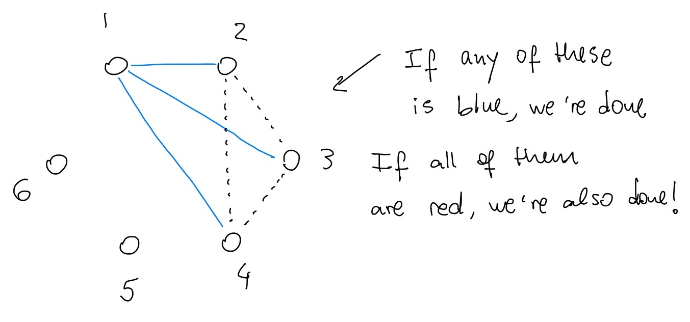
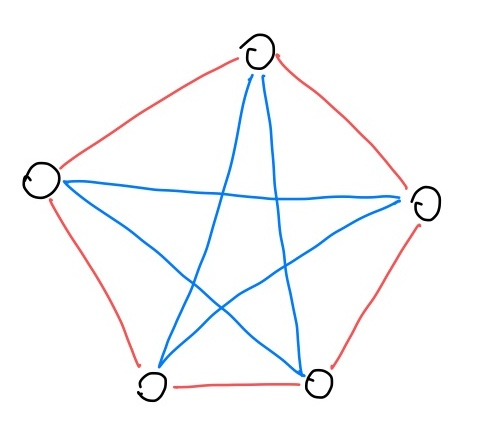

<!-- Load KaTeX CSS and JS -->
<link rel="stylesheet" href="https://cdnjs.cloudflare.com/ajax/libs/KaTeX/0.13.11/katex.min.css">

# Lecture 1: The basics of Graph Theory

Graphs provide a simple way to represent and study relationships between different objects. 

    <strong>Definition 1 (Graphs):</strong> 

A graph is a pair of sets $G = (V, E)$, where $V=V(G)$ is a finite set and $E=E(G)$ is a set of unordered pairs of elements of $V$. That is, 
$$ E \subseteq \{ \{u, v\} \mid u \neq v, u, v \in V \}. $$
$V$ is called the set of vertices, and $E$ is the set of edges.
We often write $uv$ or $vu$ for an edge $\{u,v\}$.

  

Sometimes $v(G) = \mid V(G) \mid$ is called the *order* of the graph $G$ and $e(G) = \mid E(G)\mid$ is called the *size* of the graph $G$.

## How to represent a graph to a human:

## How to represent a graph to a computer:

    <strong>Definition 2 (Adjacency matrix):</strong> 

For a graph $G = (V, E)$ with $V = \{v_1, v_2, \ldots, v_n\}$, the adjacency matrix of $G$ is the $n\times n$ matrix $A = (a_{ij})$ where
$$
a_{ij} = \begin{cases} 1 & \text{if } v_i v_j \in E(G), \\ 0 & \text{otherwise}. \end{cases}
$$

  

    <strong>Definition 3 (Incidence matrix):</strong> 

For a graph $G = (V, E)$ with $V = \{v_1, v_2, \ldots, v_n\}$ and $E = \{e_1, e_2, \ldots, e_m\}$, the incidence matrix of $G$ is the $n\times m$ matrix $B = (b_{ij})$ where
$$
b_{ij} = \begin{cases} 1 & \text{if } v_i \text{ is incident with } e_j, \\ 0 & \text{otherwise}. \end{cases}
$$

  

## Graphs as models and an initial glossary of terms

Graphs can model a wide variety of real-world situations and allows us to solve many different types of problems.
They are particularly useful for modeling social and transportation networks, scheduling management, and computer science problems.

### Social Networks

 Graphs are often used to study social networks. Each person is a vertex, and a connection between two people (like a friendship or a message) is an edge. Graphs help us understand how people are connected, who are the most influential people, or how information spreads. 

 By using the language of graph theory, we can solve the following problem:

    <strong>Problem 1:</strong>

Show that in any group of six people, there are either three people who are all friends with each other, or three people who are all strangers to each other.* Show that this is not true for five people.

 

*The relationship "friend" is symmetric, so if $A$ is a friend of $B$, then $B$ is a friend of $A$.

  
Proof

   

  Let us label the six people as $1, 2, 3, 4, 5$ and $6$ and represent them as points in the plane.
  Draw a blue line segment connecting two people if they are friends, and a red line segment if they are strangers.
  The goal is then to show that there are three points connected by line segments of the same colour.

  There are $5$ line segments "leaving" each point.
  By the [Pigeonhole Principle](https://en.wikipedia.org/wiki/Pigeonhole_principle), at least three of these line segments "leaving" the point $1$ must be of the same colour.
  We have two cases: either this colour is blue or red.
  Let us assume it is blue (the other case is similar).
  Up to relabelling, we can then assume that the points $2, 3$ and $4$ are connected to $1$ by blue line segments.

 
  
  If any of the line segments connecting $2$ to $3$, $3$ to $4$ or $4$ to $2$ is blue, then we are done, as we create a blue "triangle" together with the point $1$.
  If all of them are red, then we have a red "triangle" with the points $2, 3$ and $4$.

  Finally, the statement is not true for five people. Consider the following group of people with the relationships shown in the drawing below.

    $\quad \square$

 

This problem is part of [Ramsey theory](https://en.wikipedia.org/wiki/Ramsey_theory), one of the most important areas of combinatorics.

### Transportation Networks 

In transportation, cities can be represented as vertices, and roads or flights between cities as edges. Graphs help solve problems like finding the shortest path from one city to another (e.g., for a GPS system), or planning a route that visits several cities with the least amount of travel (like the [Traveling Salesperson Problem](https://www.youtube.com/watch?v=LL1t1WbdMZw)).

**Scheduling Management**: 
 Imagine a train schedule, where trains have to be run at certain times.
 Here, the trains are the vertices, and if two of them overlap in time, there is an edge between them.
 The goal is to find the minimum number of crews needed to run all the trains without any conflicts. Graph colourings can be used to solve this type of problem. See this [video](https://www.youtube.com/watch?v=295ONmLcj60) for an example.

 **Graphs are a very versatile tool for modelling all kinds of problems, but they are also an interesting mathematical object in their own right.**

 Before we delve into the puzzles and problems of graph theory, we need to establish some vocabulary to facilitate our communication.

    <strong>Definition 2 (Adjacency, incidence, endpoints):</strong> 

Two vertices $u,v$ are <strong>adjacent</strong> in a graph $G$ if $uv\in E(G)$. 
We say that $u$ and $v$ are <strong>endpoints</strong> of the edge $uv$, and we say that an edge $e \in E(G)$ is <strong>incident</strong> with a vertex $v$ if $v\in e$.

 

Local properties are important for understanding global properties of a graph. To explore this, we need to define the degree of a vertex.

    <strong>Definition 3 (Degree and neighbourhood):</strong> 

For a graph $G$ and a vertex $v\in V(G)$,
we say $u\in V(G)$ is a <strong>neighbour</strong> of $v$ if $uv\in E(G)$.
The set of all neighbours of $v$ is denoted by 
$$
N_G(v) = \{ u \in V(G) \mid uv \in E(G) \}.
$$ 
We refer to it as the <strong>neighbourhood</strong> of $v$.
The <strong>degree</strong> $d_G(v)$ of $v$ is the size of the neighbourhood of $v$. That is, $d_G(v) = \mid N_G(v) \mid$.

 
 

Our first lemma, known as the Handshaking Lemma, is a fundamental result in graph theory. It says that if we known the degrees of all the vertices in a graph, then we can determine its size.
See the [video](https://www.youtube.com/watch?v=8siY3EjTXxE) for an interactive proof.

    <strong> Lemma 1 (The Handshaking lemma):</strong>

For every graph $G$ we have
$$
\sum_{v\in V(G)} d_G(v) = 2e(G).
$$

  
Proof

   
  
  The informal argument goes as follows: the sum $\sum_{v\in V(G)} d_G(v)$ counts an edge $xy$ twice, once in $d_G(x)$ and once in $d_G(y)$.

  More formally, define

  $$
  S = \{ (v, e) \mid v\in V(G), e\in E(G), v\in e \}.
  $$
  Each $e\in E(G)$ belongs to precisely two pairs in $S$, so 
  $$
  |S|=2e(G).
  $$
  Each $v\in V(G)$ belongs to precisely $d_G(v)$ pairs in $S$, so we also have
  $$
  |S|=\sum_{v\in V(G)}d_G(v). \quad \square 
  $$

 

Just with this lemma, we can already solve one simple problem:)

    <strong>Problem 1:</strong>

Prove that in a graph $G$ there are an even number of vertices of odd degree.

  
Solution

   
  
  Let $V_{\text{odd}}$ be the set of vertices of odd degree and $V_{\text{even}}$ be the set of vertices of even degree in $G$. 
  By the <strong>Handshaking Lemma</strong>, we have
  $$
  \sum_{v\in V_{\text{odd}}} d_G(v) + \sum_{v\in V_{\text{even}}} d_G(v) = 2e(G). 
  $$
  By analysing this equation modulo 2, we have
  $$
  \mid V_{\text{odd}} \mid \,\, \equiv \, \, 0 \pmod{2}. \quad \square
  $$ 

 

The problem above says that if you are given a degree sequence $(d(v): v\in V(G))$ of a graph, then we know that the number of vertices with odd degree is even.
This means that not every sequence of non-negative integers can represent the degree sequence of a graph.

There are many questions we can ask about degree sequences and some of them can be quite challenging. 
One natural question is: 
given a non-negative integer $d$, are there graphs where each vertex has a degree of $d$?

    <strong> Lemma 2 (same degree):</strong>

For every non-negative integer $d$, there are infinitely many graphs $G$ such that $d_G(v) = d$ for all $v\in V(G)$.

 

The proof of this lemma follows directly from the construction of **hypercubes**.

<strong> Definition 4 (Hypercube) :</strong>

The $d$-dimensional hypercube, denoted as $Q_d$, is a graph whose vertex set consists of all binary strings of length $d$, represented by $\{0,1\}^d$. 
Two vertices in this graph are adjacent if and only if they differ in exactly one coordinate.

 

  
Proof of Lemma 2 

   
  
  Each vertex in the hypercube $Q_d$ has degree $d$. 
  To construct infinitely many graphs in which every vertex has degree $d$, one can take disjoint unions of multiple copies of $Q_d$. This process can be repeated as many times as we want. $\quad \square$

 

Graphs where every vertex has the same degree have a special name.

<strong> Definition 5 (regular graphs) :</strong>

For a non-negative integer $d$, a graph $G$ is called $d$-regular if $d_G(v) = d$ for all $v\in V(G)$.

 

Given $n \in \mathbb{N}_{\ge 1}$ and $d \in \mathbb{N}_{\ge 0}$, can we always find a $d$-regular graph with $n$ vertices?
The answer is: it depends. The degree $d$ should be at most $n-1$, for example. By the **Handshaking Lemma**, we should also have $dn$ even. 
But... are these conditions sufficient?
The answer is yes! Showing this is a hard problem.

<strong> Problem 2 :</strong>

Let $n \in \mathbb{N}_{\ge 1}$ and $d \in \mathbb{N}_{\ge 0}$. 
Show that there exists a $d$-regular graph with $n$ vertices if and only if $dn$ is even and $d\leq n-1$.

 

  
Proof

    
  
  By the discussion above, we already know that if there exists a $d$-regular graph with $n$ vertices, then $dn$ is even and $d\leq n-1$.
  For the converse, see the post of Yuval Filmus on [Math Stack Exchange](https://math.stackexchange.com/questions/1163314/degree-of-vertices-in-a-graph). $\quad \square$

 

Well, not every graph is regular. 
But we can nevertheless always find a *reasonable* regular graph *containing* it. 
To formalize this idea, we first need to say what we mean by containing.

tobedone
- definicao de subgrafo
- proposicao

